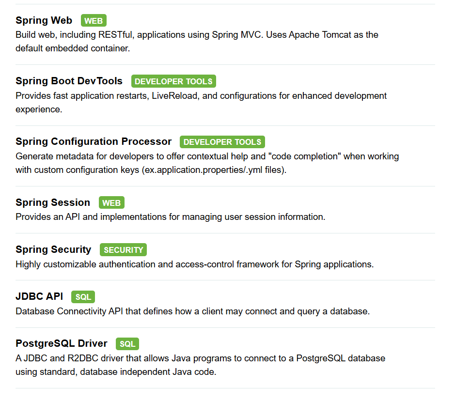

## Springboot Upskiling

To do to upskill on springboot:
- [ ] lay out the api documentation first, what to expect from the api, no auth yet, just simple crud
- [ ] design the model for this service
- [ ] implement simple crud
- [ ] security
- [ ] exception handling
- [ ] simple tests for the cruds
- [ ] database
- [ ] impl repository
- [ ] impl controller
- [ ] impl service

For the current movie management project this are the dependencies that were added:
